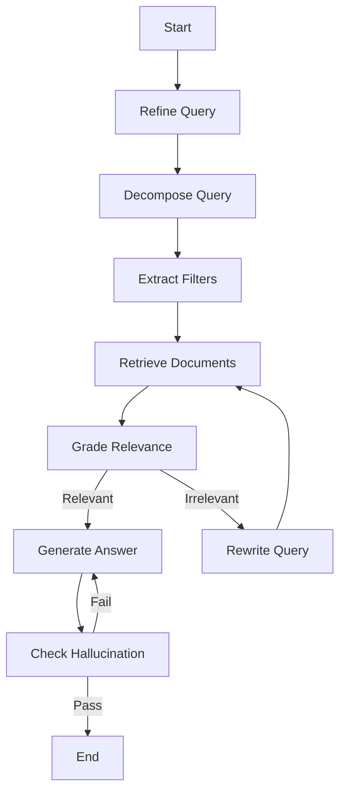

# 🏦 BNM Policy RAG Agent

A specialized **Retrieval-Augmented Generation (RAG)** system designed to accurately answer questions about **Bank Negara Malaysia (BNM)** regulatory policy documents. 

Built with **LangGraph**, **ChromaDB**, and **Google Gemini 2.0 Flash / Qwen 2.5**, this agent features advanced retrieval strategies including **Small-to-Big Retrieval**, **query decomposition**, and **hallucination checks** to ensure high-precision answers with exact citations.


---

## 🚀 Key Features

*   **Hierarchical Indexing ("Small-to-Big")**: Indexes individual **clauses** for precise retrieval but provides **parent section** context to the LLM for comprehensive understanding.
*   **Intelligent Metadata Filtering**: Automatically extracts filters (e.g., `topic`, `regulatory_type`, `is_islamic`) from user queries to narrow down search space (e.g., distinguishing *Debit Card Policy* from *Credit Card Policy*).
*   **Self-Correcting Workflow**:
    *   **Hallucination Check**: Verifies generated answers against retrieved documents. If the answer isn't supported, it retries or reports "Not found".
    *   **Query Refinement**: Rewrites ambiguous queries and expands them with BNM-specific terminology.
*   **Robust Ingestion**: Custom PDF pipeline that handles complex BNM formatting including **appendices**, **tables**, and **nested schedules**.
*   **Precision Evaluation**: Integrated **RAGAS** evaluation pipeline measuring Faithfulness, Answer Relevancy, Context Precision, and Recall.

---

## 🏗️ Architecture

The agent follows a cyclic graph architecture implemented in `src/graph.py`:



---

## 🛠️ Installation

1.  **Clone the repository**
    ```bash
    git clone https://github.com/yourusername/bnm-policy-rag.git
    cd bnm-policy-rag
    ```

2.  **Create a virtual environment**
    ```bash
    python -m venv venv
    source venv/bin/activate  # Windows: venv\Scripts\activate
    ```

3.  **Install dependencies**
    ```bash
    pip install -r requirements.txt
    ```

4.  **Configuration**
    Copy `.env.example` to `.env` and set your API keys:
    ```bash
    cp .env.example .env
    ```
    
    Edit `.env`:
    ```env
    OPENROUTER_API_KEY=sk-or-v1-your-key-here
    ```

---

## 📖 Usage

### Run the API Server
Start the FastAPI server:

```bash
python src/server.py
```

The API will be available at `http://localhost:8000`. 
- **Interactive Docs**: [http://localhost:8000/docs](http://localhost:8000/docs)

**Endpoints:**
- `POST /query`: Submit a natural language question
- `POST /ingest`: Trigger document re-ingestion
- `GET /health`: System health check

**Example Request:**
```bash
curl -X POST "http://localhost:8000/query" \
     -H "Content-Type: application/json" \
     -d '{"query": "What are the e-KYC requirements?", "include_sources": true}'
```

### Run CLI Agent
To ask a question via the command line:

```bash
python src/graph.py "What is the maximum late payment charge for credit cards?"
```

### Ingest Documents
To process new PDFs from the `data/` directory:

```bash
python src/ingestion.py
```

### Run Evaluation
To run the RAGAS evaluation suite against `tests/eval_dataset.json`:

```bash
# Run full pipeline + evaluation
python tests/ragas_evaluation.py

# Re-calculate metrics on cached results (skip pipeline)
python tests/ragas_evaluation.py --skip-pipeline
```

---

## 📊 Evaluation Results

Recent benchmark on 30+ diverse regulatory questions:

| Metric | Score | Threshold | Status |
| :--- | :---: | :---: | :---: |
| **Faithfulness** | 0.81 | 0.80 | ✅ PASS |
| **Answer Relevancy** | 0.82 | 0.80 | ✅ PASS |
| **Context Precision** | 0.78 | 0.70 | ✅ PASS |
| **Context Recall** | 0.88 | 0.70 | ✅ PASS |

---

## 📂 Project Structure

```text
.
├── src/
│   ├── graph.py       # Main LangGraph application logic
│   ├── ingestion.py   # PDF processing and vector DB indexing
│   ├── retriever.py   # Hybrid retrieval (BM25 + Semantic + Reranking)
│   └── check.py       # Hallucination and grading implementation
├── tests/
│   ├── ragas_evaluation.py  # Evaluation runner
│   └── eval_dataset.json    # Golden dataset (Questions + Ground Truths)
├── data/              # Raw BNM PDF documents
└── chroma_db/         # Persisted vector database
```

## ⚠️ Disclaimer
This tool is for **informational purposes only** and does not constitute official legal or financial advice. Always verify with the official documents hosted on [bnm.gov.my](https://www.bnm.gov.my/policy-documents).
